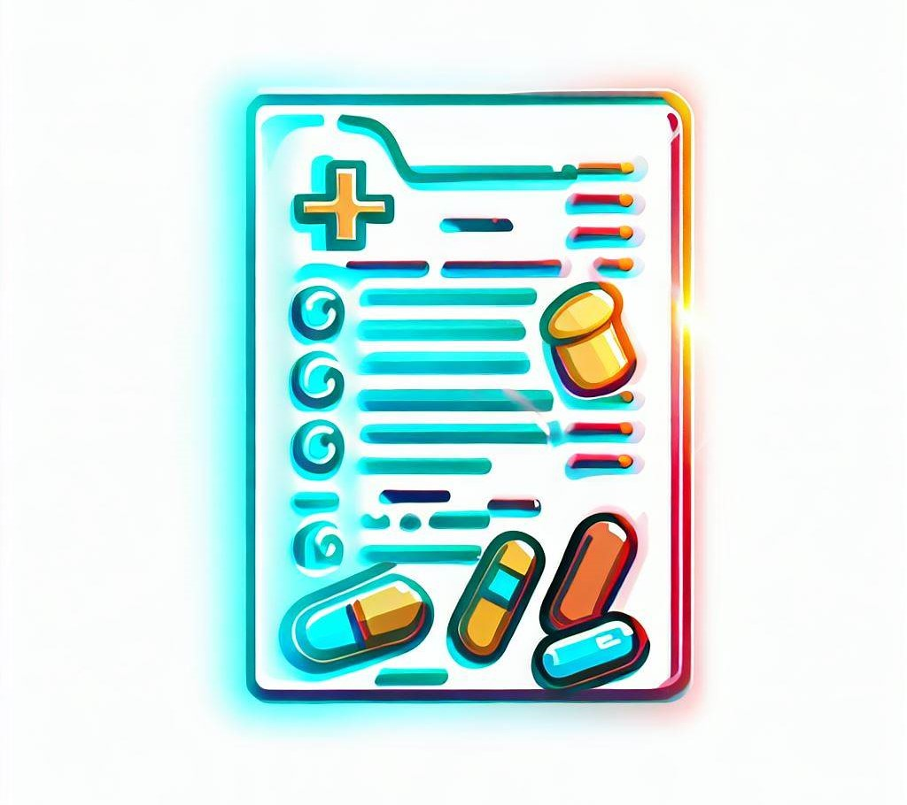

# Medical Prescription NER
from Terry Abraham(stu_id: 101439293) & Nooh Faisal(stu_id: 101444062)

 

 

## Introduction

The Medical Prescription NER (Named Entity Recognition) project focuses on creating a tool that can accurately extract specific entities from medical prescriptions. This allows users or patients preferably to easily identify drugs, dosages, and durations without manually parsing the entire text. This project will utilize advanced NLP techniques, including the fine-tuning of a BERT (Bidirectional Encoder Representations from Transformers) model,  and leverages the Spacy library to provide visually appealing and informative output.

 

## Problem Statement
Medical prescriptions contain vital information regarding the medications, dosages, and durations prescribed to patients. However, the process of manually extracting this information from prescriptions can be time-consuming and error-prone for healthcare professionals. Currently, there is a lack of efficient and automated tools that can accurately identify and extract specific entities from medical prescriptions, hindering the ability of doctors to quickly access essential information and potentially leading to medication errors or delays in patient care.

The existing methods for parsing medical prescriptions rely heavily on manual effort, requiring healthcare professionals to read through the entire prescription text and identify relevant information manually. This process is not only tedious and time-consuming but also leaves room for human error, potentially resulting in adverse effects on patient safety and treatment outcomes.

By developing a Medical Prescription NER system, we aim to address this problem by automating the extraction of medical entities from prescriptions. This will significantly reduce the burden on healthcare professionals, allowing them to quickly identify drugs, dosages, and durations without manually parsing the entire text. The system will provide accurate and reliable information extraction, enhancing patient safety, and streamlining the workflow of healthcare providers.

## Features
The key objectives/features of the Medical Prescription NER project are as follows:

- **Named Entity Recognition:** The project employs advanced NER techniques to identify and extract specific entities such as drugs, dosages, and durations from medical prescriptions.

- **BERT Model:** The project utilizes the BERT (Bidirectional Encoder Representations from Transformers) model, a state-of-the-art natural language processing model, to fine-tune the NER system specifically for medical prescriptions.
- **Fine-Tuning:** We fine-tune the BERT model using annotated medical prescription data, enabling it to accurately recognize medical entities in prescriptions.
- **Spacy Integration:** The extracted entities are processed and visualized using the Spacy library, which provides eye-catching and informative output, making it easier for users to understand and interpret the results.

## Data and Annotation
The dataset used for this project is the I2B2 dataset, which can be found at https://www.i2b2.org/. The I2B2 dataset comprises medical documents and provides valuable data for training a Named Entity Recognition (NER) model specifically for medical prescriptions. However, please note that the dataset is not included in this repository due to the strict Data Use Policy of I2B2. To access the dataset, you will need to contact I2B2 and sign a Data Use Agreement. I2B2 is known for their prompt response, so you should be able to obtain the dataset in a timely manner.

The annotation process is performed using [**Tecoholic**](https://tecoholic.github.io/ner-annotator/) , a web-based annotation tool. Tecoholic provides an efficient way to label medical entities in the prescription text, such as drugs, dosages, and durations. The annotation process involves manually labeling the entities of interest to create a labeled dataset for training the NER model.

## Conclusion
The Medical Prescription NER project automates the extraction of entities like drugs,diseases, dosages, and durations from medical prescriptions. Leveraging advanced NLP techniques, including fine-tuned BERT models and the Spacy library. This project provides an accuracy of 86.6% and displays reliable information extraction.

Manual extraction from prescriptions is time-consuming and error-prone. By automating the process, this project reduces the burden on healthcare professionals, minimizing errors and delays in patient care.The project also focuses on improving patient safety, streamlines workflows, and optimizes care by enabling users to quickly identify crucial information in prescriptions.

## References
- Bert Fine tuning for NER jupyter notebook
- [**Tecoholic**](https://tecoholic.github.io/ner-annotator/) annotation tool
- I2B2 dataset